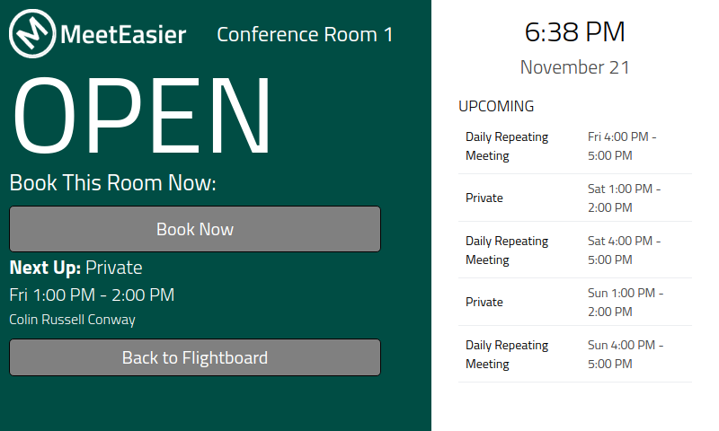
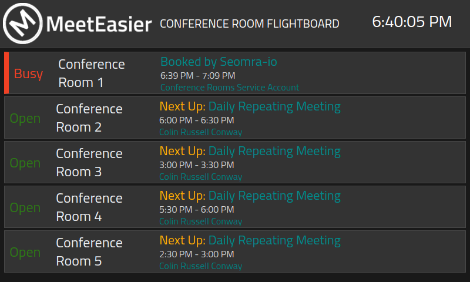
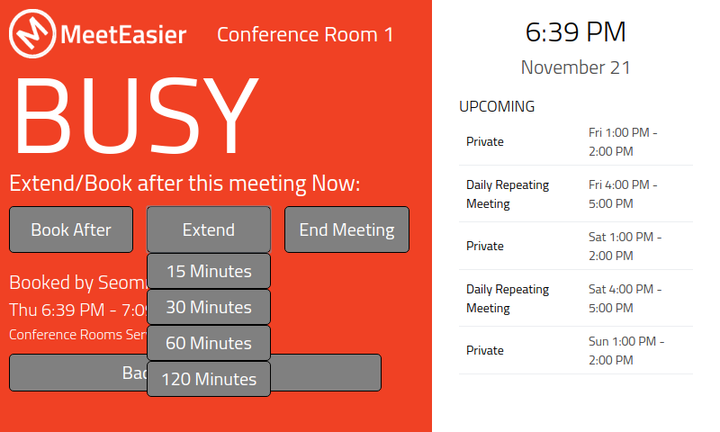

# MeetEasier - Custom Fork for Raspberry Pi Official Touchscreen


## Description
This is a customised fork of "MeetEasier" https://github.com/danxfisher/MeetEasier.
MeetEasier is a web application that visualizes meeting room availability.  It works using Exchange Web Services (EWS) with Exchange room lists in Office 365.

This particular fork adds additional functionality (e.g. buttons for making bookings, extending bookings and ending meetings) and hides some options depending on environment variables (set in the .env files)



***

## License

MeetEasier is licensed under the open source [GNU General Public License (GPL 3.0)](https://github.com/danxfisher/MeetEasier/blob/master/LICENSE).

In the event of wanting to commercially distribute a closed source modification of this code, please contact me.

***


## Assumptions

This application assumes you have:

* Exchange Online (Office 365)
* Conference room mailboxes organized in room lists
* Exchange Web Services (EWS) enabled
* A service account with access to all conference room mailboxes and EWS
* A web server with Node.js installed to run the application

**Please Note:** This application uses Basic Authentication which, by its very nature, is insecure.  I would strongly suggest using SSL where ever you decide to run this.

***

## Installation

1. *Optional*: Install IISNode
    * I've also included a `web.config` file for an IIS install
2. In root directory, open a terminal or cmd:
    ```
    $ npm install
    ```
3. In the root directory, open a terminal or cmd:
    ```
    $ npm run build
    ```
4. In the root directory, open a terminal or cmd:
    ```
    $ npm start
    ```
5. If you want to start the react development server, in the root directory run:
    ```
    $ npm start-ui-dev
    ```

***

## Root Folder Structure Explained

* `app/` : Routes for EWS APIs
* `app/ews/` : All EWS functionality
* `confg/` : All server side configuration settings
* `scss/` : All styles
* `static/` : All global static files
* `ui-react/` : Front end React routes and components

***

## React /src Folder Structure Explained

There are three main directories in the `ui-react/src/` folder:

* `components/` : Components separated in folders by function
* `config/` : Customizable config file (see defails below in Customization section)
* `layouts/` : Layout components for the two different layouts used.

### Components

* `flightboard/` : All components related to the flightboard or "all meeting" layout
* `global` : Components that will be used by both layouts
* `single-room` : All components related to the Single Room layout

#### components/flightboard/

* `Board` : Actual flightboard component itself
* `Clock` : Clock component for the upper right hand of the display
* `Navbar` : Top navigation/title bar piece
* `RoomFilter` : Room list filter in the navbar

#### components/global/

* `NotFound` : A "not found" page if an error or "404" occurs
* `Socket` : A service component to run the web socket connection for updating the flightboard and single room display

#### components/single-room/

* `Clock` : Clock component for the upper right hand of the display
* `Display` : All other features of the single room display

### Config

* `flightboard.config.js` : Simple customization config explained in the Customization section

### Layouts

* `flightboard/` : Layout for flightboard display
* `single-room/` : Layout for single room display

***

## Customization

### Simple

* In `/config/auth/auth.js`, enter your credentials and domain:

    ```javascript
    module.exports = {
      // this user MUST have full access to all the room accounts
      'exchange' : {
        'username'  : 'SVCACCT_EMAIL@DOMAIN.COM',
        'password'  : 'PASSWORD',
        'uri'       : 'https://outlook.office365.com/EWS/Exchange.asmx'
      },
      'domain' : 'DOMAIN'
    };
    ```

* Alternatively, username, password and domain can be set as environment variable

    ```bash
    export USERNAME=svcacct_email@domain.com
    export PASSWORD=password
    export DOMAIN=domain.com
    ```

* In `/config/room-blacklist.js`, add any room by email to exclude it from the list of rooms:

    ```javascript
      module.exports = {
        'roomEmails' : [
          'ROOM_EMAIL@DOMAIN.com'
        ]
      };
    ```

* In `/ui-react/src/config/flightboard.config.js`, manage your customizations:

    ```javascript
    module.exports = {
      'board' : {
        'nextUp' : 'Next Up',
        'statusAvailable' : 'Open',
        'statusBusy' : 'Busy',
        'statusError' : 'Error'
      },

      'navbar' : {
        'title' : 'Conference Room Availability',
      },

      'roomFilter' : {
        'filterTitle' : 'Locations',
        'filterAllTitle' : 'All Conference Rooms',
      },
    };
    ```

* Upload your logo to `/static/img/logo.png`

### Advanced

* All EWS functionality is located in `app/ews`.
* To change the interval in which the web socket emits, edit the interval time in `app/socket-controller.js`.  By default, it is set to 1 minute.
* To update styles, make sure you install grunt first with `npm install -g grunt-cli`.  Then run `grunt` in the root directory to watch for SCSS changes.  Use the `.scss` files located in the `/scss` folder.
  * All React components can be locally styled by adding a new `.css` file and importing it into the component itself if you'd prefer to do it that way.
* In `app/ews/rooms.js`, there is a block of code that may not be necessary but were added as a convenience.  Feel free to use it, comment it out, or remove it completely.  It was designed for a use case where the email addresses (ex: jsmith@domain.com) do not match the corporate domain (ex: jsmith-enterprise).
    ```javascript
    // if the email domain != your corporate domain,
    // replace email domain with domain from auth config
    var email = roomItem.Address;
    email = email.substring(0, email.indexOf('@'));
    email = email + '@' + auth.domain + '.com';
    ```

***

## Flightboard Layout Mockup



## Single Room Layout Mockup



***

## Resources & Attributions

* [ews-javascript-api](https://github.com/gautamsi/ews-javascript-api)
